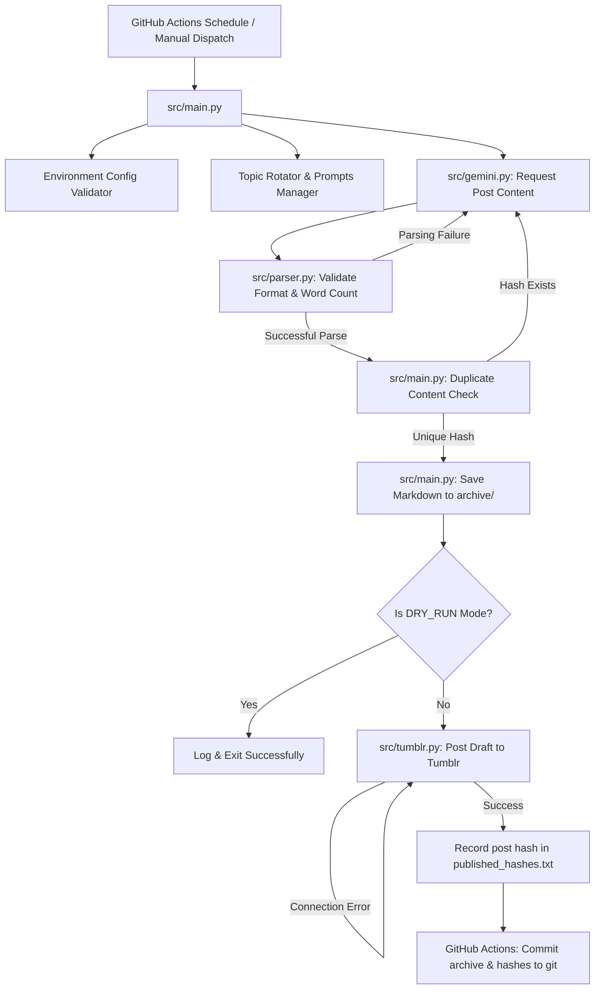

# Tumblr AI Auto Publisher

A production-ready, modular Python project that automatically generates reflective, thought-provoking essays using the **Google Gemini API** and publishes them daily as drafts to **Tumblr** using the **Tumblr API**.

---

## Technical Architecture



---

## Features

- **Automated Daily Publishing**: Triggered automatically using GitHub Actions cron scheduling.
- **Gemini 3.5 Flash**: Leverages the latest Google Gen AI API for human-like, reflective writing.
- **Clean Markdown Formatting**: Generated posts support markdown headers, lists, and formatting.
- **Robust Parsing & Validation**: Validates the output format and word count; retries automatically up to 3 times on parsing or validation failures.
- **Duplicate Post Prevention**: Computes SHA-256 hashes of generated text and checks them against `published_hashes.txt` before uploading.
- **Automatic Archiving**: Saves every generated post in the `archive/` folder as a `.md` file for local record-keeping.
- **Dry-run Mode**: Configurable flag to preview the generated post and local archiving without committing the publish operation to Tumblr.
- **Manual Control**: Allows workflow runs with manual topic override directly via GitHub Actions.

---

## Installation & Local Development

### Prerequisites
- Python 3.10 or higher
- A Google Gemini API key
- A Tumblr account and registered developer application

### Setup Steps
1. **Clone the repository:**
   ```bash
   git clone https://github.com/your-username/tumblr-ai-blog.git
   cd tumblr-ai-blog
   ```

2. **Create a virtual environment:**
   ```bash
   python3 -m venv .venv
   source .venv/bin/activate  # On Windows, use `.venv\Scripts\activate`
   ```

3. **Install dependencies:**
   ```bash
   pip install --upgrade pip
   pip install -r requirements.txt
   ```

4. **Configure Environment Variables:**
   Create a `.env` file in the root directory:
   ```env
   # AI Credentials
   GEMINI_API_KEY=your_gemini_api_key_here

   # Tumblr Credentials
   TUMBLR_CONSUMER_KEY=your_tumblr_consumer_key_here
   TUMBLR_CONSUMER_SECRET=your_tumblr_consumer_secret_here
   TUMBLR_TOKEN=your_tumblr_token_here
   TUMBLR_TOKEN_SECRET=your_tumblr_token_secret_here
   BLOG_NAME=your_blog_username.tumblr.com

   # Optional Settings
   DRY_RUN=false
   WORD_COUNT_MIN=800
   WORD_COUNT_MAX=1200
   GEMINI_MODEL=gemini-3.5-flash
   ```

5. **Run the application locally:**
   ```bash
   # Run in Dry-run mode to verify without publishing
   DRY_RUN=true python src/main.py
   
   # Run in normal mode to publish a draft
   python src/main.py
   ```

6. **Run Unit Tests:**
   ```bash
   pytest
   ```

---

## API Credential Setup

### 1. How to create a Google Gemini API Key
1. Visit [Google AI Studio](https://aistudio.google.com/).
2. Log in with your Google account.
3. Click on **Get API Key** in the top left.
4. Click **Create API Key** (you can select a new project or an existing one).
5. Copy the generated key and save it securely.

### 2. How to create a Tumblr Application
1. Go to the [Tumblr API console](https://www.tumblr.com/oauth/apps).
2. Click **Register Application**.
3. Fill out the application details:
   - **Application Name**: Tumblr AI Publisher
   - **Application Website**: `https://github.com/your-username/tumblr-ai-blog`
   - **Default Callback URL**: `http://www.tumblr.com/dashboard` (can be any valid URL for personal applications)
4. Click **Save** at the bottom.
5. You will now see your **OAuth Consumer Key** and **OAuth Consumer Secret**.
6. To get the **OAuth Access Token** and **OAuth Token Secret** for your own account:
   - Go to [Tumblr API Console](https://api.tumblr.com/console).
   - Authorize the console with your account.
   - It will display your specific access keys (`OAuth Token` and `OAuth Token Secret`) which you can use directly.

---

## GitHub Secrets Configuration

To run the publisher automatically on GitHub Actions, add the following secrets to your repository:

1. In your GitHub repository, navigate to **Settings** > **Secrets and variables** > **Actions**.
2. Click **New repository secret** and add:
   - `GEMINI_API_KEY`
   - `TUMBLR_CONSUMER_KEY`
   - `TUMBLR_CONSUMER_SECRET`
   - `TUMBLR_TOKEN`
   - `TUMBLR_TOKEN_SECRET`
   - `BLOG_NAME`

---

## Triggering from GitHub Actions

### Scheduled Runs
The workflow is configured in `.github/workflows/post.yml` to trigger daily at **9:00 AM UTC** automatically. 

### Manual Execution
1. In your GitHub repository, go to the **Actions** tab.
2. Select the **Daily Tumblr AI Auto Publisher** workflow from the left sidebar.
3. Click the **Run workflow** dropdown menu.
4. (Optional) Toggle `dry-run` to generate/archive content without posting to Tumblr.
5. (Optional) Provide a manual topic override (e.g. `scuba diving`).
6. Click **Run workflow**.

---

## Troubleshooting

- **Error: `Missing required environment variables`**: Ensure all GitHub Secrets or `.env` variables are correctly spelled and populated.
- **Error: `401 Unauthorized` (Tumblr)**: Double check that your OAuth Access Token and Token Secret are correct for the targeted blog, and that you have registered the app under the same account.
- **Error: `ParseError`**: The Gemini API output did not match the expected structure of TITLE, BODY, and TAGS. Check the model output. The system automatically retries 3 times, which handles occasional layout issues.
- **Action runs but doesn't push archives**: Check that your GitHub repository settings allow actions to push changes: **Settings** > **Actions** > **General** > **Workflow permissions** > Select **Read and write permissions**.

---

## Future Improvements

- **Image Attachment**: Generate contextual images using Gemini/Imagen and publish them alongside the text.
- **Scheduled Publishing**: Publish immediately at randomized hours of the day rather than always running exactly at the GHA run time.
- **Custom Fonts and Styling**: Automatically inject HTML templates for rich media layout inside Tumblr.